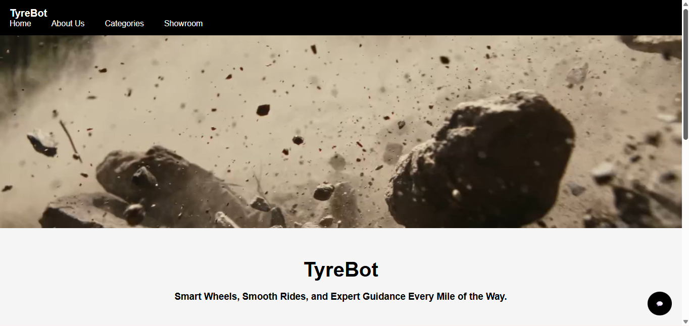

# TyreBot-website

TyreBot is a modern e-commerce website built using HTML, CSS, and JavaScript, designed to help users explore and purchase tyres for cars, bikes, and trucks. It also includes a rule-based chatbot that assists users with tyre recommendations and specifications.

[**🔗Live Website**](https://kethnulee-weerasinghe4.github.io/TyreBot-website/)



---

## Project Overview
TyreBot is developed as a smart and user-friendly platform focused on simplifying the tyre buying experience. The website allows users to browse through different categories such as car tyres, bike tyres, and truck tyres, each presented with clear and organized layouts.

A key feature of the platform is the integrated chatbot, which provides instant responses to user queries. Instead of manually searching through products, users can interact with the chatbot to get recommendations based on their vehicle type and usage. The chatbot also explains tyre specifications, helping users make informed decisions.

The design emphasizes simplicity and accessibility, ensuring a smooth experience. TyreBot aims to combine e-commerce functionality with intelligent assistance to create a more efficient and engaging user journey.

---

## Features
- E-commerce interface (Car, Bike, Truck categories)
- Rule-based chatbot for instant assistance
- Tyre specification explanations (size, width, usage)
- Vehicle-based tyre recommendations
- Video-based modern homepage design
- Organized categories and product cards

---

## 5. Tech Stack

### Frontend
- HTML
- CSS
- JavaScript

### Backend
- None (Frontend-only project)

---

## Installation

### Option 1: Run Locally
Clone the repository:
```bash
git clone https://github.com/Kethnulee-Weerasinghe4/TyreBot-website.git
cd TyreBot-website
